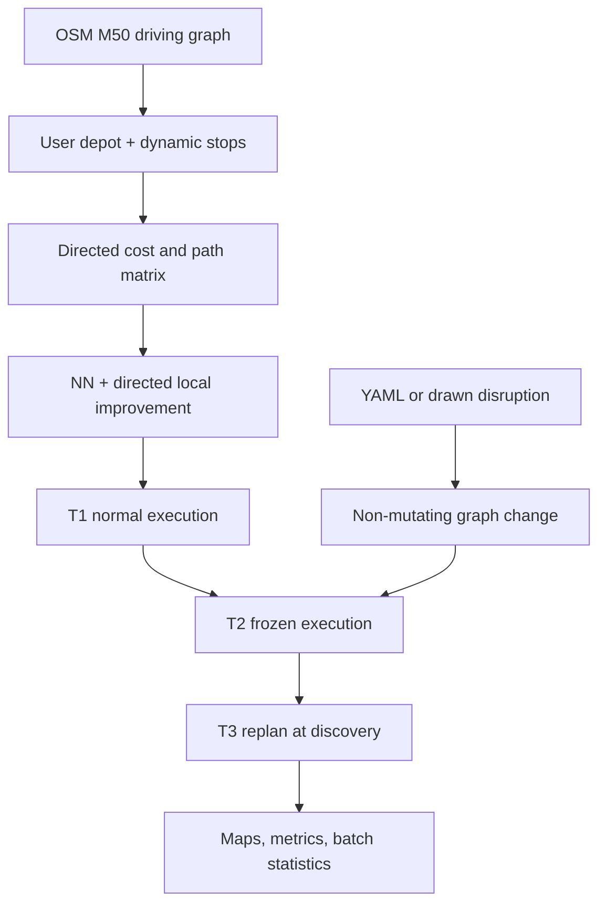

# Disruption-Aware Last-Mile Delivery Routing

[](https://github.com/shlokshetty71002/dynamic-last-mile-delivery-routing/actions/workflows/ci.yml)
[](https://github.com/shlokshetty71002/dynamic-last-mile-delivery-routing/actions/workflows/live-network-acceptance.yml)

A reproducible mathematical-modelling system for planning Dublin deliveries, simulating road
disruptions, and measuring whether reactive re-optimisation improves the route. It was developed
for **UCD ACM40960 — Projects in Mathematical Modelling** by **Shlok Shetty** and
**Rushikesh Mane**.

The user chooses the depot, the number of delivery stops `N` (`1 ≤ N ≤ 50`), the actual
locations, fleet size `K`, and a disruption. No experiment assumes a fixed route size.

## What the model compares

| Case | Meaning |
|---|---|
| `T1` | Original route in normal conditions. |
| `T2` | Same stop order after disruption; by default the driver discovers a blocked edge reactively and detours. |
| `T3` | Time already driven plus a re-optimised route through the remaining stops from the discovery node. |
| `T3_oracle` | Separate upper benchmark: full disruption knowledge and re-optimisation from time zero. |

The headline measure is `Saving (%) = (T2 - T3) / T2 × 100`. An operational no-regret
guard keeps the frozen detour if the heuristic replan is worse, so a finite `T3` cannot exceed
`T2`. Infeasible service is retained as a structured result rather than dropped.



## Quickstart

Prerequisites: Git and 64-bit Python 3.11 or 3.12. The first real-network command downloads
OpenStreetMap data; later runs use a validated fast sidecar backed by the hashed GraphML cache.

### Windows PowerShell

```powershell
git clone https://github.com/shlokshetty71002/dynamic-last-mile-delivery-routing.git
Set-Location .\dynamic-last-mile-delivery-routing
python -m venv .venv
.\.venv\Scripts\python.exe -m pip install -r requirements.txt
.\.venv\Scripts\python.exe -m pip install --no-deps -e .
.\.venv\Scripts\python.exe -m pytest
.\.venv\Scripts\dlm.exe network build
.\.venv\Scripts\streamlit.exe run app\main.py
```

Open the local URL printed by Streamlit, normally <http://localhost:8501>. See the
[complete Windows run and Git guide](docs/WINDOWS_RUN_AND_GIT_GUIDE.md) for troubleshooting,
testing, committing, pushing, and keeping work off the university repository.

### macOS or Linux

```bash
git clone https://github.com/shlokshetty71002/dynamic-last-mile-delivery-routing.git
cd dynamic-last-mile-delivery-routing
make setup
make ci
make app
```

## Reproduce an experiment

```bash
# Build/cache the directed, strongly connected M50-catchment driving graph.
.venv/bin/dlm network build

# Plan one committed instance.
.venv/bin/dlm plan \
  --instance data/instances/small-n8.json \
  --output results/small-plan.json

# Compare T1/T2/T3 and create JSON, HTML, PNG, and SVG outputs.
.venv/bin/dlm compare \
  --instance data/instances/small-n8.json \
  --scenario scenarios/oconnell_march.yaml \
  --information-model reactive \
  --output-dir results/small-oconnell

# Run 204 committed/random cases and regenerate the report figure.
make experiment
make figures
```

On Windows, replace `.venv/bin/dlm` with `.\.venv\Scripts\dlm.exe`. `make reproduce`
regenerates the canonical instances, quality gates, 204-case experiment, and figures. Runtime
depends on the graph and machine; report run-time telemetry is stored separately from scientific
result fields.

## Model and implementation

- OSMnx obtains a directed `drive` network for the explicit M50-catchment envelope; NetworkX
  provides weighted shortest paths. The largest strongly connected component prevents silent
  one-way reachability failures.
- Missing OSM `maxspeed` values use a versioned Irish road-class table; all internal distances
  are metres and times are seconds.
- Depots and stops can come from addresses, coordinates, 46 curated Dublin presets, seeded
  random road nodes, or map clicks. Portable JSON instances store coordinates and are snapped
  to the current cached graph at runtime.
- The primary solver is nearest-neighbour construction followed by directed full-cost 2-opt and
  relocate moves. Clarke-Wright handles `K > 1` and capacity; OR-Tools is a benchmark adapter.
- Versioned YAML supports edge, node, polygon, corridor, and slow-zone disruptions. A scenario
  always produces a new graph plus an audit record; the cached base graph is never mutated.
- The Streamlit/Folium app is a thin client. Routing and modelling logic lives only in `src/dlm/`
  and the parity tests call the same workflows as the CLI.

The fixed 180-second service time, 8.5 L/100 km diesel use, and €1.75/L fuel price are explicit,
configurable modelling assumptions—not observations. The direct diesel factor is 2.68 kg CO₂/L,
rounded from the [SEAI conversion factor](https://www.seai.ie/data-and-insights/seai-statistics/conversion-factors).

## Verification status

| Stage | Deliverable | Status |
|---:|---|:---:|
| 0 | Environment, packaging, tests, CI, documentation | ✅ |
| 1 | Cached directed M50 road graph and travel times | ✅ |
| 2 | Dynamic, mutable, saveable delivery instances | ✅ |
| 3 | Cached and incrementally updatable asymmetric matrix | ✅ |
| 4 | Nearest-neighbour + directed improvement baseline | ✅ |
| 5 | Versioned YAML disruption engine and audit trail | ✅ |
| 6 | Reactive/omniscient execution, T1/T2/T3/oracle | ✅ |
| 7 | Seeded batch runner, bootstrap statistics, figures | ✅ |
| 8 | Fleet, capacity, Clarke-Wright, OR-Tools benchmark | ✅ |
| 9 | Full CLI, deterministic outputs, reproduction target | ✅ |
| 10 | Barebones Streamlit/Folium thin client and parity tests | ✅ |

The deterministic suite contains 60 tests across graph handling, dynamic instance sizes,
incremental matrices, solvers, disruptions, execution, batch statistics, and CLI/UI parity.
CI runs it on Python 3.11 and 3.12. Real OSM acquisition is intentionally a manual GitHub
Actions acceptance workflow because ordinary CI must remain deterministic and independent of
third-party network availability.

## Repository map

- `src/dlm/` — network, instance, solver, disruption, simulation, visualisation, and workflows.
- `app/` — Streamlit widgets and session state only.
- `data/instances/` — canonical N=8, N=20, and N=40 coordinate-portable instances.
- `data/presets/` — curated named Dublin locations.
- `scenarios/` — four versioned modelling scenarios and their schema.
- `tests/` — deterministic directed fixtures and scientific regression tests.
- `docs/` — model, data provenance, architecture, ADRs, stage evidence, and user guides.
- `results/` — generated outputs; ignored except for its format documentation.

Start with the [documentation map](docs/index.md), [mathematical model](docs/modelling.md),
[data provenance](docs/data.md), or [CLI reference](docs/cli.md).

## Data, attribution, and scope

Road data and map tiles are © OpenStreetMap contributors and are available under the ODbL;
see the [OpenStreetMap copyright and licence page](https://www.openstreetmap.org/copyright).
The committed disruption files are transparent **simulated modelling scenarios**, not live
traffic notices or claims that a closure is currently active. See [limitations](docs/limitations.md)
before interpreting results.

No software licence is granted by this repository unless a `LICENSE` file is added explicitly.
