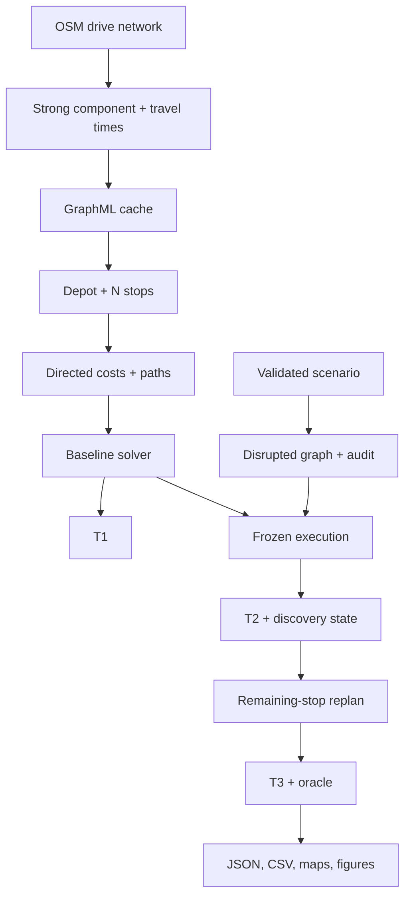

# Architecture

## Boundary rules

1. Scientific and routing logic lives in `src/dlm/`; `app/` owns widgets and session state only.
2. CLI and UI call `plan_delivery` and `compare_delivery`, so equal inputs traverse equal code.
3. `N` and `K` are read from the validated instance at runtime; neither is a module constant.
4. A disruption returns a changed graph copy and audit record; the cached base graph is immutable.
5. Expensive graph, geocode, and matrix work is cache-keyed by complete scientific inputs.
6. Random selection and stochastic closures always require a seed.

## End-to-end flow

## Module ownership

| Module | Owns | Does not own |
|---|---|---|
| `network` | OSM acquisition, SCC, edge speeds/time, safe snapping | Stops, solver policy |
| `instance` | Schema, location inputs, geocoding, matrix/cache | Disruption semantics |
| `solver` | NN, directed local search, Clarke-Wright, OR-Tools adapter | Graph download, plotting |
| `disruption` | YAML/GeoJSON schema, graph application, audit, generators | Route optimisation |
| `simulation` | Route execution, information model, replanning, metrics, batch | UI state |
| `viz` | Folium maps and deterministic Matplotlib figures | Metric calculation |
| `workflows.py` | Shared application use cases and portable-instance resolution | Presentation |
| `cli.py` | Option parsing, file destinations, calls to workflows | Duplicate algorithms |
| `app/` | Widgets, cache decorators, download packaging, session state | Domain logic |

## Cache and identity model

- Network key: schema version, bbox/place, `network_type`, simplify flag, OSMnx version, and
  complete speed-default table.
- Matrix key: graph signature, ordered node set, and weight attribute. Adding one point runs one
  forward and one reverse single-source shortest-path calculation, then preserves all old cells.
- Geocode key: normalised query and provider result; ambiguous candidates are cached but never
  silently selected.
- Run ID: hash of the instance, scenario, solver, information model, and sustainability factors.

Canonical instance files store coordinates rather than OSM node IDs because OSM evolves. The
shared workflow snaps them to the graph used by that run; the source JSON is not mutated.

## Failure model

Typed validation errors explain bad coordinates, excessive snap distance, duplicate nodes,
ambiguous addresses, invalid fleet/capacity, or malformed YAML. If a disruption disconnects a
stop, execution returns `partial`/`infeasible` with missed stop IDs and null finite metrics. It
does not erase the case or replace infinity with a misleading number.
